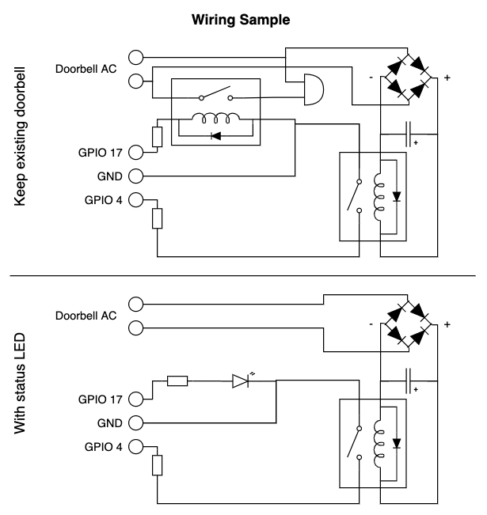

# Homebridge GPIO doorbell

This plugin listens the GPIO input of the Raspberry PI and passes it as a HomeKit doorbell.

> :warning: This plugin is only designed for and tested on Raspberry PI.
> There's no guarantee, the plugin works also on other boards equipped with GPIO!

## Configuration

| key | type | description |
|---|---|---|
| name | string | The name of the accessory. | 
| gpioPin | integer | The GPIO pin the plugin should listen to. | 
| throttleTime | integer | How many milliseconds should another ring be ignored after the doorbell rang last? | 
| reverseInput | boolean | If enabled, a high input on the gpio pin is interpreted as low and the other way around. |
| enableOutput | boolean | If enabled, a doorbell ring causes a specified GPIO pin to be set HIGH simultaneously. |
| outputGpioPin | integer | The output GPIO pin. |

## Wiring

> :warning: **In case of incorrect wiring you can damage your PI!**

### Doorbell input

To connect your doorbell to your PI via GPIO, connect a GPIO pin with GND and the button, relay, etc. and a resistor between.

> :warning: Most doorbells run with 12V AC.
> Therefore, you cannot attach your doorbell directly to your PI.
> You will need a rectifier, capacitor and relay in between for instance.
> The more easy way would be to directly use an AC relay.

### Doorbell output

Optionally you can add a separate output which is triggered when the doorbell rings.
This way you can keep your existing bell working or add a separate buzzer for instance.

## Support & Contribution

This project is not commercially developed or maintained.
Therefore, it might take some time after opening an issue until it is solved.
But anyway: If you experience any bugs feel free to open an issue or create a pull request.
Contribution is always welcome.
